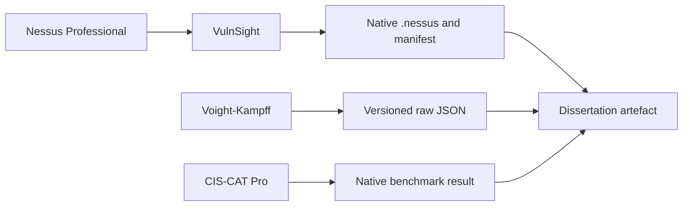

# Capstone Evidence Collectors

This repository contains the two researcher-developed evidence collectors used to support the MSc capstone project **Context-Aware Security Risk Prioritisation Using Machine Learning and Multi-Source Security Telemetry**.

Both collectors pre-date the capstone. The versions preserved here have been modified and hardened specifically to satisfy the project's evidence, provenance, failure-handling, reproducibility, and source-boundary requirements. They remain upstream collection tools and are **not** the dissertation artefact itself.

## Repository status

The versions currently held here are **integration-pilot candidates**. Their unit and contract tests pass, and they are suitable for the `PILOT-WIN-01` integration exercise. They are not frozen or eligible for final controlled evidence collection until they have completed the integration pilot and the resulting collection bundle has been versioned and checksummed.

| Collector | Pilot-candidate version | Current verification | Project role |
| --- | --- | --- | --- |
| [Voight-Kampff](collectors/voight-kampff/) | Agent 2.1.0; schema 1.1; JSON depth 10 | 18 modules, 46 acquisition units, 617/617 Pester tests | Collects versioned Windows endpoint evidence and explicit acquisition outcomes. |
| [VulnSight](collectors/vulnsight/) | 0.3.1; Nessus export manifest 1.1 | 781/781 pytest tests | Acquires an explicitly selected native `.nessus` export and writes its acquisition manifest and SHA-256. |

These results establish behaviour against the collectors' test contracts. They do not, by themselves, establish that a real campaign is complete, that every provider works on every target, or that collected evidence is eligible for the final experiment.

## Repository layout

```text
capstone-collectors/
├── README.md
├── .gitignore
├── collectors/
│   ├── voight-kampff/
│   └── vulnsight/
└── docs/
    ├── evidence-boundary.md
    ├── capstone-modifications.md
    └── version-matrix.md
```

Each collector retains its own README, runtime requirements, tests, versioning, and usage instructions. The root documentation records why these particular versions exist and how they relate to the capstone evidence design.

## Evidence boundary



The boundary is deliberate:

- **Nessus Professional** performs vulnerability scanning.
- **VulnSight** selects and acquires the requested completed scan history. It validates the exported XML envelope, preserves the native `.nessus` bytes, and records acquisition provenance. It does not parse findings into the analytical model.
- **Voight-Kampff** records raw Windows endpoint observations and per-unit acquisition outcomes. It performs no vulnerability applicability judgement, contextual scoring, compliance decision, or prioritisation.
- **CIS-CAT Pro** is a production benchmark-assessment source. It is not developed in this repository.
- **The dissertation artefact** separately validates, pseudonymises, parses, normalises, reconciles, contextualises, scores, evaluates, and reports the admitted evidence.

Raw principal identifiers remain unchanged in the secured source records. Pseudonymisation occurs later in the dissertation artefact, before admitted principal data enters analytical datasets.

## Collector summaries

### Voight-Kampff

Voight-Kampff is a Windows PowerShell evidence collector. The capstone candidate adds and hardens the acquisition contract needed to distinguish observed values from failed, restricted, unavailable, or successful-empty collection.

Capstone-relevant capabilities include:

- versioned JSON output with agent and schema identity;
- explicit acquisition units and governed data paths;
- four acquisition outcomes: `success`, `failed`, `restricted`, and `unavailable`;
- separation of successful empty results from unsuccessful acquisition;
- Windows host, service, process, software, network, security-control, user, group, session, and profile observations admitted by the project design;
- domain-aware current-session and session-principal evidence;
- recent-profile evidence explicitly marked as a profile-use proxy rather than an interactive-logon record;
- modular-runner and generated-standalone parity; and
- dependency-free Windows PowerShell 5.1 operation.

The remaining feature-state extension is intentionally not populated until the frozen contextual registry supplies exact Windows feature identifiers and authoritative documentation. General feature inventory is out of scope.

See [the Voight-Kampff README](collectors/voight-kampff/README.md) for collector-specific instructions.

### VulnSight

VulnSight is a Python command-line utility that acquires native Nessus scan exports through the Nessus API.

Capstone-relevant capabilities include:

- explicit Nessus connectivity and authentication checks;
- read-only scan and history discovery;
- explicit scan and history selection with no automatic “latest” choice;
- native `.nessus` export acquisition;
- bounded streaming download and SHA-256 calculation;
- defensive XML validation without constructing a findings tree;
- no-overwrite output and atomic failure cleanup;
- human-readable filenames containing the safe scan-name slug, scan ID, and history ID; and
- a versioned acquisition manifest recording tool, source, selection, export, artefact, and validation metadata.

VulnSight deliberately ends at trustworthy acquisition. Nessus finding extraction, host–CVE–campaign construction, normalisation, source reconciliation, and prioritisation belong to the dissertation artefact.

See [the VulnSight README](collectors/vulnsight/README.md) for installation, configuration, commands, and security guidance.

## Mapping to the capstone design

| Design area | Collector contribution | Downstream responsibility |
| --- | --- | --- |
| Host–CVE–campaign occurrence | VulnSight supplies the selected native Nessus evidence and acquisition manifest. | The artefact parses admitted findings, resolves host and campaign identity, and consolidates supporting observations. |
| C1: Remote reachability | Nessus supplies scanner-vantage observations; Voight-Kampff supplies listener and service state. | The artefact evaluates coverage, authority, conflicts, and the frozen applicability rule. |
| C2: Component state | Voight-Kampff supplies service, process, installed-product, and—where later admitted—exact optional-feature state. | The artefact maps the affected component and resolves present, absent, neutral, or unknown evidence. |
| C3: Exploit prerequisite | Voight-Kampff, Nessus, and mapped CIS-CAT evidence may supply admitted observations. | The artefact requires an exact authoritative exploit-path warrant and frozen field mapping. |
| C4: Compensating mitigation | Voight-Kampff and mapped CIS-CAT findings supply observable settings. | The artefact applies the frozen mitigation mapping without treating aggregate compliance scores as evidence. |
| C5: Interactive use | Voight-Kampff supplies direct current-session evidence and recent-profile proxy evidence. | The artefact may confirm relevant interactive use from direct evidence; proxy-only or missing evidence remains unknown. |
| C6: Low-privilege pathway | Voight-Kampff supplies accounts, groups, sessions, session principals, RDP, and WinRM evidence. | The artefact applies frozen principal-to-pathway and rights mappings and does not infer absence from missing rights evidence. |
| C7: Protection degradation | Voight-Kampff supplies antivirus and Microsoft Defender operating state; mapped CIS-CAT findings may corroborate. | The artefact resolves the frozen condition and retains conflict and uncertainty. |

This mapping describes collection capability, not automatic eligibility. A field contributes only when the frozen rule registry supplies the required applicability gate, authority, source mapping, state semantics, and provenance.

## Relationship to the implementation plan

This repository implements the **immediate collector-packaging horizon** of the dissertation implementation plan. Its next gate is the `PILOT-WIN-01` single-host integration pilot.

The pilot will determine whether these exact collector versions can participate in one coordinated campaign alongside Nessus Professional and CIS-CAT Pro while preserving:

- host and campaign identity;
- observation time and collection outcome;
- immutable raw source evidence;
- version and schema provenance;
- explicit unknown and failure behaviour;
- artefact-side pseudonymisation; and
- reconstruction from canonical evidence to its raw source.

After the pilot, validated collector commits, versions, configurations, and generated artefacts will be frozen and checksummed before controlled evidence collection.

## Security and data handling

This public repository must not contain:

- API access keys, secret keys, passwords, credentials, or tokens;
- `.env` files or machine-specific configuration containing secrets;
- native `.nessus` exports or acquisition manifests from real scans;
- Voight-Kampff evidence JSON;
- CIS-CAT assessment results;
- pseudonymisation keys or identity mappings;
- experimental evidence or results;
- Python environments, PowerShell build output, caches, or transient test logs; or
- real hostnames, user names, SIDs, IP addresses, scan targets, or other environment identifiers.

Use synthetic fixtures for tests and documentation. Treat any accidentally staged secret or evidence file as compromised even if it is removed before a later commit; remove it from the Git history before publishing and rotate any exposed credential.

## Project provenance

Voight-Kampff and VulnSight are pre-existing researcher-developed tools. The capstone work modifies selected versions to meet the dissertation's collection and provenance requirements. The dissertation's original contribution is the separate framework that combines calibrated CVE-level modelling with relevance-gated host contextualisation; it does not claim either collector as newly created for the project.

Detailed source commits, imported versions, modification summaries, runtimes, schemas, test results, and freeze status should be maintained in [`docs/version-matrix.md`](docs/version-matrix.md) and [`docs/capstone-modifications.md`](docs/capstone-modifications.md).

## Licence and warranty

This repository is made public for academic transparency and reproducibility. Licensing remains as stated within each collector directory. Where no licence is present, no permission to reuse, modify, or redistribute should be inferred solely from public availability.

The software is provided without warranty and is intended for authorised systems and controlled laboratory use. Users are responsible for obtaining permission before collecting or scanning any system.
