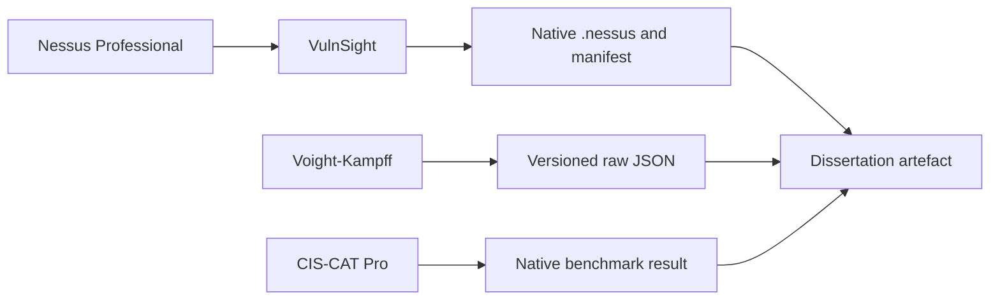

# Capstone Evidence Collectors

This repository contains the two researcher-developed evidence collectors used to support the MSc capstone project **Context-Aware Security Risk Prioritisation Using Machine Learning and Multi-Source Security Telemetry**.

Both collectors pre-date the capstone. The versions preserved here have been modified and hardened specifically to satisfy the project's evidence, provenance, failure-handling, reproducibility, and source-boundary requirements. They remain upstream collection tools and are **not** the dissertation artefact itself.

## Repository status

The versions currently held here are **integration-validated acquisition components**. Their unit and contract tests pass and both have been exercised against a real target in non-campaign integration validation. **They are not frozen** and are not eligible for controlled evidence collection.

**They are not yet suitable for `PILOT-WIN-01`.** As recorded on 2026-09-05, Voight-Kampff `2.3.0` sits on branch `feat/voight-2.3-evidence-expansion` and is **pending merge at the time of this record**; it was **untagged and unfrozen** when observed on that date. **Current branch, merge, tag and freeze status must be obtained from the repository, not from this file.** VulnSight `0.3.1` is **merged and unfrozen**. Freezing and pilot eligibility follow a successful formal pilot and a versioned, checksummed collection bundle.

> **The development integration rehearsal `REHEARSAL-WIN-01` and the formal integration pilot `PILOT-WIN-01` are different exercises and are never used interchangeably.** A rehearsal is disposable, closes no gate and produces no evidence; the pilot is the formal exercise whose `PASS` is a `GATE B1` prerequisite.
>
> **`REHEARSAL-WIN-01` has run and closed `PASS` with findings.** Its output is **permanently ineligible as research evidence**, and it **did not close `GATE B1`** — a rehearsal cannot. **`PILOT-WIN-01` has not run.**

| Collector | Pilot-candidate version | Current verification | Project role |
| --- | --- | --- | --- |
| [Voight-Kampff](collectors/voight-kampff/) | Agent 2.3.0; schema 1.2; JSON depth 10 | 46 modules, 48 acquisition units, 20 of those modules instrumented; **753/753** Pester tests passed at agent 2.3.0 (Pester 6.1.0, Windows PowerShell Desktop 5.1.26100.9168). Development live validation, 2026-09-05: 137 valid optional-feature records, 48/48 units `success` | Collects versioned Windows endpoint evidence and explicit acquisition outcomes. |
| [VulnSight](collectors/vulnsight/) | 0.3.1; Nessus export manifest 1.1 | 781/781 pytest tests | Acquires an explicitly selected native `.nessus` export and writes its acquisition manifest and SHA-256. |

These results establish behaviour against the collectors' test contracts. They do not, by themselves, establish that a real campaign is complete, that every provider works on every target, or that collected evidence is eligible for the final experiment.

**Voight-Kampff 2.3.0 state.** Agent 2.3.0 adds the complete Windows optional-feature inventory as raw evidence. Schema moves 1.1 → 1.2, an **additive** increment: the five-section envelope, acquisition entry shape and four-value outcome vocabulary are unchanged, and no existing field path is added to, removed, moved or redefined. Its source provenance is implementation commit `2f93b4b9bd19329952c22de47ee587483882f1f3` on branch `feat/voight-2.3-evidence-expansion`. **As recorded on 2026-09-05 it was pending merge at the time of this record, and was untagged and unfrozen when observed; no freeze identity existed for it on that date.** These are dated observations, not permanent states - **read current branch, merge, tag and freeze status from the repository.**

**Development live validation, 2026-09-05.** A development run of the generated 2.3.0 standalone returned **137 valid optional-feature records, 48/48 successful acquisition units, no duplicate feature names, no malformed records, and correct ordinal ordering**. **The live run and the generated standalone are development validation artefacts.** They are **not** formal-pilot output, **not** research evidence, and **not** a freeze identity.

**Voight-Kampff 2.1.1 merge state (historical).** The 2.1.1 live-provider edge-case repair is **merged into `main`** through **pull request #1**, at merge commit `a928acd942cae2dd071f416700eaaa9e6a4f421a`. Its history is preserved: repair commit `afa421ead68d94a678d96766424c6ead9f689933` (*fix(voight): handle empty Windows provider values*) and documentation commit `6830dce3feecc595eb9fbf351593ca9871b1552f` are ancestors of the merge and are **not interchangeable** with it as provenance identities. **2.1.1 remains untagged, unfrozen and not campaign-ready**, and is **superseded as the current version** by 2.3.0. Its live runs on `CAPSTONE-WIN-01` are **integration-validation** runs — not `REHEARSAL-WIN-01`, not `PILOT-WIN-01`, and not controlled campaign evidence.

**Rehearsal findings.** `ISS-005` remains part of the `REHEARSAL-WIN-01` historical record and is not rewritten by any later work; its **technical cause has since been corrected and live-validated in Voight-Kampff 2.2.0 and 2.3.0**. `ISS-004` remains an open **formal-pilot procedural reminder**: start instrumented timing **before** snapshot restoration.

## Repository layout

```text
capstone-collectors/
├── README.md
├── .gitignore
├── collectors/
│   ├── voight-kampff/
│   └── vulnsight/
└── docs/
    ├── evidence-boundary.md
    ├── capstone-modifications.md
    └── version-matrix.md
```

Each collector retains its own README, runtime requirements, tests, versioning, and usage instructions. The root documentation records why these particular versions exist and how they relate to the capstone evidence design.

## Evidence boundary


```mermaid
flowchart LR
    N[Nessus Professional] --> V[VulnSight]
    V --> NE[Native .nessus and manifest]
    VK[Voight-Kampff] --> VE[Versioned raw JSON]
    C[CIS-CAT Pro] --> CE[Native benchmark result]
    NE --> A[Dissertation artefact]
    VE --> A
    CE --> A
```

The boundary is deliberate:

- **Nessus Professional** performs vulnerability scanning.
- **VulnSight** selects and acquires the requested completed scan history. It validates the exported XML envelope, preserves the native `.nessus` bytes, and records acquisition provenance. It does not parse findings into the analytical model.
- **Voight-Kampff** records raw Windows endpoint observations and per-unit acquisition outcomes. It performs no vulnerability applicability judgement, contextual scoring, compliance decision, or prioritisation.
- **CIS-CAT Pro** is a production benchmark-assessment source. It is not developed in this repository.
- **The dissertation artefact** separately validates, pseudonymises, parses, normalises, reconciles, contextualises, scores, evaluates, and reports the admitted evidence.

Raw principal identifiers remain unchanged in the secured source records. Pseudonymisation occurs later in the dissertation artefact, before admitted principal data enters analytical datasets.

## Collector summaries

### Voight-Kampff

Voight-Kampff is a Windows PowerShell evidence collector. The capstone candidate adds and hardens the acquisition contract needed to distinguish observed values from failed, restricted, unavailable, or successful-empty collection.

Capstone-relevant capabilities include:

- versioned JSON output with agent and schema identity;
- explicit acquisition units and governed data paths;
- four acquisition outcomes: `success`, `failed`, `restricted`, and `unavailable`;
- separation of successful empty results from unsuccessful acquisition;
- Windows host, service, process, software, network, security-control, user, group, session, and profile observations admitted by the project design;
- domain-aware current-session and session-principal evidence;
- recent-profile evidence explicitly marked as a profile-use proxy rather than an interactive-logon record;
- the complete Windows optional-feature inventory as raw evidence;
- modular-runner and generated-standalone parity; and
- dependency-free Windows PowerShell 5.1 operation.

**Windows optional-feature collection (agent 2.3.0).** The collector now records the **full** optional-feature inventory as raw evidence, under `host.windows_optional_features`, governed by the single acquisition unit `host.windows_optional_features.inventory`. Each record carries exactly `feature_name` and `state`. The provider's own state string is preserved verbatim and **never reduced to a Boolean**, so `Enabled`, `Disabled`, `DisabledWithPayloadRemoved`, `EnablePending` and `DisablePending` remain distinct observations. Records are ordered deterministically by `feature_name` using an ordinal comparison.

**There is no allowlist and no analytical interpretation.** The collector applies no project-specific feature filter, attaches no category or security label, and makes no risk, applicability or compliance judgement. **Research-specific feature selection and contextual interpretation remain downstream artefact responsibilities** — the collector's job is to record what the host reported.

This supersedes the earlier position that feature-state collection had to wait on the frozen contextual registry supplying exact identifiers. That position coupled a *collection* question to an *analysis* question; collecting the whole inventory removes the coupling, because the identifiers the research eventually selects are already present in the artefact.

See [the Voight-Kampff README](collectors/voight-kampff/README.md) for collector-specific instructions.

### VulnSight

VulnSight is a Python command-line utility that acquires native Nessus scan exports through the Nessus API.

Capstone-relevant capabilities include:

- explicit Nessus connectivity and authentication checks;
- read-only scan and history discovery;
- explicit scan and history selection with no automatic “latest” choice;
- native `.nessus` export acquisition;
- bounded streaming download and SHA-256 calculation;
- defensive XML validation without constructing a findings tree;
- no-overwrite output and atomic failure cleanup;
- human-readable filenames containing the safe scan-name slug, scan ID, and history ID; and
- a versioned acquisition manifest recording tool, source, selection, export, artefact, and validation metadata.

VulnSight deliberately ends at trustworthy acquisition. Nessus finding extraction, host–CVE–campaign construction, normalisation, source reconciliation, and prioritisation belong to the dissertation artefact.

See [the VulnSight README](collectors/vulnsight/README.md) for installation, configuration, commands, and security guidance.

## Mapping to the capstone design

| Design area | Collector contribution | Downstream responsibility |
| --- | --- | --- |
| Host–CVE–campaign occurrence | VulnSight supplies the selected native Nessus evidence and acquisition manifest. | The artefact parses admitted findings, resolves host and campaign identity, and consolidates supporting observations. |
| C1: Remote reachability | Nessus supplies scanner-vantage observations; Voight-Kampff supplies listener and service state. | The artefact evaluates coverage, authority, conflicts, and the frozen applicability rule. |
| C2: Component state | Voight-Kampff supplies service, process, installed-product, and the complete raw optional-feature inventory. | The artefact selects the study-relevant feature identifiers, maps the affected component, and resolves present, absent, neutral, or unknown evidence. |
| C3: Exploit prerequisite | Voight-Kampff, Nessus, and mapped CIS-CAT evidence may supply admitted observations. | The artefact requires an exact authoritative exploit-path warrant and frozen field mapping. |
| C4: Compensating mitigation | Voight-Kampff and mapped CIS-CAT findings supply observable settings. | The artefact applies the frozen mitigation mapping without treating aggregate compliance scores as evidence. |
| C5: Interactive use | Voight-Kampff supplies direct current-session evidence and recent-profile proxy evidence. | The artefact may confirm relevant interactive use from direct evidence; proxy-only or missing evidence remains unknown. |
| C6: Low-privilege pathway | Voight-Kampff supplies accounts, groups, sessions, session principals, RDP, and WinRM evidence. | The artefact applies frozen principal-to-pathway and rights mappings and does not infer absence from missing rights evidence. |
| C7: Protection degradation | Voight-Kampff supplies antivirus and Microsoft Defender operating state; mapped CIS-CAT findings may corroborate. | The artefact resolves the frozen condition and retains conflict and uncertainty. |

This mapping describes collection capability, not automatic eligibility. A field contributes only when the frozen rule registry supplies the required applicability gate, authority, source mapping, state semantics, and provenance.

## Relationship to the implementation plan

This repository implements the **immediate collector-packaging horizon** of the dissertation implementation plan. Its next gate is the `PILOT-WIN-01` single-host integration pilot.

The pilot will determine whether these exact collector versions can participate in one coordinated campaign alongside Nessus Professional and CIS-CAT Pro while preserving:

- host and campaign identity;
- observation time and collection outcome;
- immutable raw source evidence;
- version and schema provenance;
- explicit unknown and failure behaviour;
- artefact-side pseudonymisation; and
- reconstruction from canonical evidence to its raw source.

After the pilot, validated collector commits, versions, configurations, and generated artefacts will be frozen and checksummed before controlled evidence collection.

## Security and data handling

This public repository must not contain:

- API access keys, secret keys, passwords, credentials, or tokens;
- `.env` files or machine-specific configuration containing secrets;
- native `.nessus` exports or acquisition manifests from real scans;
- Voight-Kampff evidence JSON;
- CIS-CAT assessment results;
- pseudonymisation keys or identity mappings;
- experimental evidence or results;
- Python environments, PowerShell build output, caches, or transient test logs; or
- real hostnames, user names, SIDs, IP addresses, scan targets, or other environment identifiers.

Use synthetic fixtures for tests and documentation. Treat any accidentally staged secret or evidence file as compromised even if it is removed before a later commit; remove it from the Git history before publishing and rotate any exposed credential.

## Project provenance

Voight-Kampff and VulnSight are pre-existing researcher-developed tools. The capstone work modifies selected versions to meet the dissertation's collection and provenance requirements. The dissertation's original contribution is the separate framework that combines calibrated CVE-level modelling with relevance-gated host contextualisation; it does not claim either collector as newly created for the project.

Detailed source commits, imported versions, modification summaries, runtimes, schemas, test results, and freeze status should be maintained in [`docs/version-matrix.md`](docs/version-matrix.md) and [`docs/capstone-modifications.md`](docs/capstone-modifications.md).

## Licence and warranty

This repository is made public for academic transparency and reproducibility. Licensing remains as stated within each collector directory. Where no licence is present, no permission to reuse, modify, or redistribute should be inferred solely from public availability.

The software is provided without warranty and is intended for authorised systems and controlled laboratory use. Users are responsible for obtaining permission before collecting or scanning any system.
