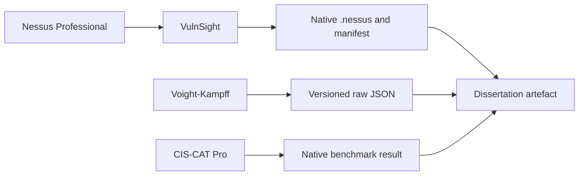

# Evidence Boundary

## Purpose

This document fixes the boundary between the source tools and the separate dissertation artefact.

## Source responsibilities

| Source | Responsibility | Explicitly outside the source boundary |
| --- | --- | --- |
| Nessus Professional | Conduct authorised vulnerability scans and create native scan evidence. | Dissertation-specific contextual scoring or host-condition resolution. |
| VulnSight | Verify connectivity; discover scans and histories; acquire an explicitly selected native `.nessus` export; validate its XML envelope; record acquisition provenance and SHA-256. | Findings parsing, normalisation, pseudonymisation, host–CVE–campaign construction, contextualisation, or prioritisation. |
| Voight-Kampff | Collect versioned raw Windows endpoint observations and explicit acquisition outcomes. | Pseudonymisation of raw evidence, vulnerability applicability judgement, contextual scoring, compliance decisions, or priority calculation. |
| CIS-CAT Pro | Produce native benchmark-assessment findings. | Capstone-specific finding admission, contextual mapping, or use of aggregate compliance scores as priority adjustments. |

## Dissertation-artefact responsibilities

The separate dissertation artefact is responsible for:

- immutable raw-source admission and checksum verification;
- schema and provenance validation;
- quarantine and explicit failure reporting;
- source-specific parsing and source-neutral normalisation;
- stable experiment-specific pseudonymisation;
- host, CVE, campaign, plugin, and benchmark-finding linkage;
- evidence authority, conflict, temporal, applicability, and three-state resolution;
- assertion deduplication and bounded contextual scoring;
- CVE-level modelling and evaluation; and
- reconstructable machine-readable and human-readable reporting.

Raw source evidence is never rewritten to satisfy an analytical contract. Analytical admission occurs through explicit allow-lists and versioned transformations.
